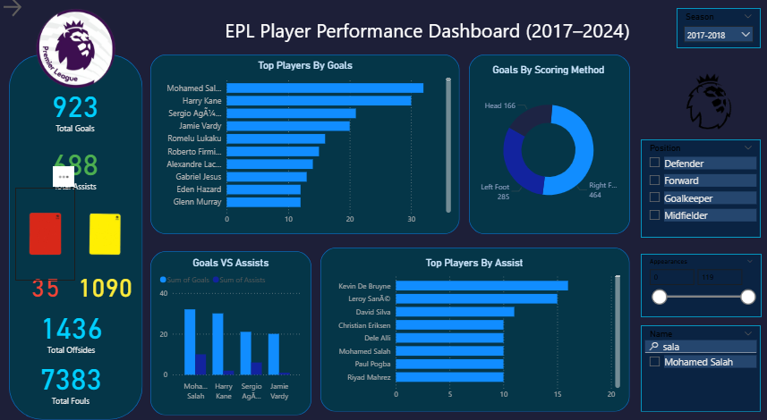
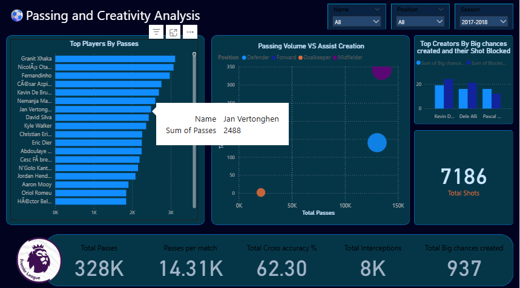

# ⚽ EPL Player Statistics Dashboard (2017–2024)

An **interactive Power BI dashboard** analyzing Premier League player statistics across 7 seasons (2017/18 – 2023/24).  

The project demonstrates **data cleaning, transformation, and visualization** — all built from scratch using Kaggle datasets.  

---

## 📌 Project Overview
The goal was to create a **comprehensive 2-page dashboard** that helps answer key football questions:

- Which players contributed the most goals and assists?  
- How were goals scored (left foot, right foot, headers)?  
- Who were the top passers and chance creators?  
- How do passing volume and assist creation relate?  
- What trends can be spotted across different seasons?  

The dashboard includes **interactive filters** so users can drill down by season, player name, position, and appearances.

---

## 📂 Dataset
- **Source**: Kaggle – [Premier League Player Stats 2015–2024]([https://www.kaggle.com/](https://www.kaggle.com/code/desalegngeb/english-premier-league-players-statistics))  
- **Seasons covered**: 2017/18 → 2023/24  
- **Data type**: Player-level stats (appearances, goals, assists, passes, tackles, fouls, etc.)  
- **Format**: Multiple CSVs (one per season)  

Each season’s file had slightly different columns, so I had to carefully **align and standardize** them.

---

## 🛠 Tools & Skills Used
- **Power BI Desktop** – dashboard building  
- **Power Query** – cleaning and appending yearly files  
- **Excel** – quick checks and formatting  
- **GitHub** – project hosting and documentation  

---

## 🔄 Data Preparation Process
1. **Loading Data**  
   - Imported each CSV (2015–2024) into Power BI.  
   - Some sheets had extra index columns → removed.  
   - Some had extra stats (e.g., interceptions, recoveries) → aligned across years.  

2. **Cleaning**  
   - Trimmed blank spaces in player names.  
   - Replaced nulls with `0` for numeric stats (e.g., Goals, Assists).  
   - Ensured consistent data types (integers for counts, decimal for percentages).  

3. **Combining Datasets**  
   - Used **Append Queries** in Power Query to merge all seasons.  
   - Added a **“Season” column** manually to track year.  

4. **Handling Outliers**  
   - Filtered players with very few appearances (to avoid skewed per-match averages).  

---

## 🎨 Dashboard Design
- **Theme**: Dark background (`#01031F`) with contrast panels (`#053648`) for charts.  
- **Color coding**:  
  - Goals → ⚽ Yellow/Gold  
  - Assists → 🅰️ Light Blue  
  - Fouls → 🔴 Red shades  
  - Cards → Yellow & Red  
  - Passes → Green tones  

- **Filters (Slicers)**:  
  - Season (2017–2024)  
  - Player position  
  - Appearances  
  - Player search  

---

## 📊 Page 1 — Summary Dashboard
Main KPIs (Cards):  
- Total Goals  
- Total Assists  
- Total Shots  
- Total Passes  
- Total Fouls, Offsides, Yellow & Red Cards  

Visuals:  
- **Bar Chart**: Top players by goals  
- **Bar Chart**: Top players by assists  
- **Bar Chart**: Top players by passes  
- **Pie Chart**: Goals by scoring method (left, right, head)  
- **Scatter Plot**: Passing volume vs assists created  

---

## 📊 Page 2 — Advanced Breakdown
- **Pass distribution charts** (Passes per match vs accuracy)  
- **Assists vs Shots Created** (bar comparison)  
- **Detailed player table** (with slicer interactivity)  
- Future space for xG, defensive actions, etc.  

---

## 🔍 Insights Gained
- Top scorers stand out not only in **goals** but also in **method of scoring** (headers vs footed goals).  
- Some players with **high passing volume** are not always the highest in **assists**, showing role differences (deep playmakers vs chance creators).  
- Cards, fouls, and offsides highlight discipline metrics alongside performance.  

---

## ⚡ Challenges
- Datasets had inconsistent columns across years → required manual alignment.  
- Some values were missing → replaced with `0`.  
- Choosing colors for visuals took *hours* — still not confident I nailed it 🎨😂.  
  👉 **Question for the community**: How do you approach color themes in dashboards?  

---

## 📷 Screenshots
  
  

---

## 🚀 Next Steps
- Add advanced metrics (Expected Goals, xA if available)  
- Create club-level aggregation views  
- Automate refresh with live football data API  
- Publish dashboard to Power BI Service for online interaction  

---

## 📌 Project Files   
- Full dataset available on Kaggle: [link here]([https://www.kaggle.com/](https://www.kaggle.com/code/desalegngeb/english-premier-league-players-statistics))  

---

## 🤝 Feedback
This is only my **second polished project** (I built many drafts before but they were ugly to share 😅).  

I’d love your thoughts:  
- What do you think about the layout and storytelling?  
- How do you personally manage **color themes**?  
- Any general advice on improving data projects?  

---
